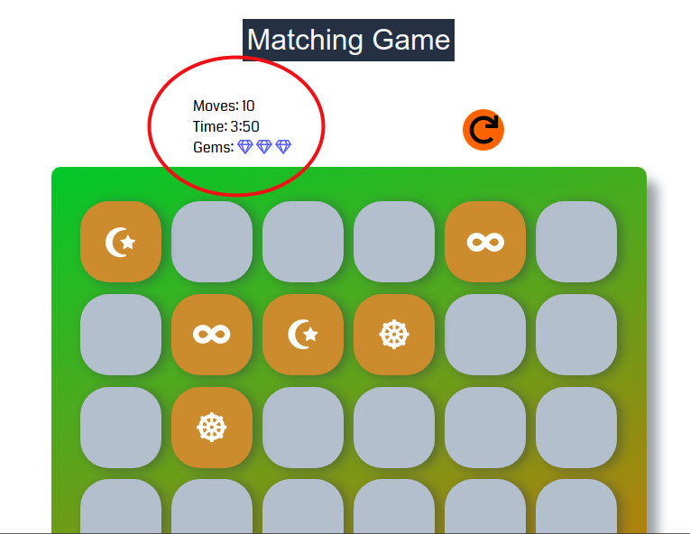

# Memory Game Project

## Description

Memory Game is one of several projects built to practice the concepts taught in Udacity's Front-End Nanodegree program and is required to graduate the program.
It is based on the popular [Concentration game](https://en.wikipedia.org/wiki/Concentration_(game)).

**Head over [here](https://wryhder.github.io/FEND-Memory-Game/) to play.**

## How to Play

Click a card to turn it over. When a pair of cards match, they stay face up, but if two open cards do match, they are turned back down.
There are a total of 18 card pairs that need to be matched. The game is over when that happens.

On the score panel, you can track the number of moves you've made at any point in the game, time elapsed since you started, and the number of gems (similar to stars) left.
Each time two cards are opened, it's counted as one move.



Click the reset button to reset the game at any time.


**Note:** The cards are shuffled on each play to ensure unpredictability.

## Run a Local Copy
To run the app locally:
1. Change (or `cd`) into the directory you want it in.

2. Clone the repo

```
git clone https://github.com/Wryhder/FEND-Memory-Game.git
```
3. Spin up a local server, or simply open `index.html` in your browser

## Dependencies

[Font Awesome (v5.3.1)](https://fontawesome.com/)

## Usage

Students from the program may use this repo's code to get an idea of how to approach their own project. Please do NOT copy/paste.

Otherwise, fork and modify as you please.

## Todo
- Implement automated integration testing
- Add animation effects to matched and unmatched cards
- Save game state using local storage
- Optimize game
- Make game accessible (keyboard shortcuts, ...)
- Add a service worker
